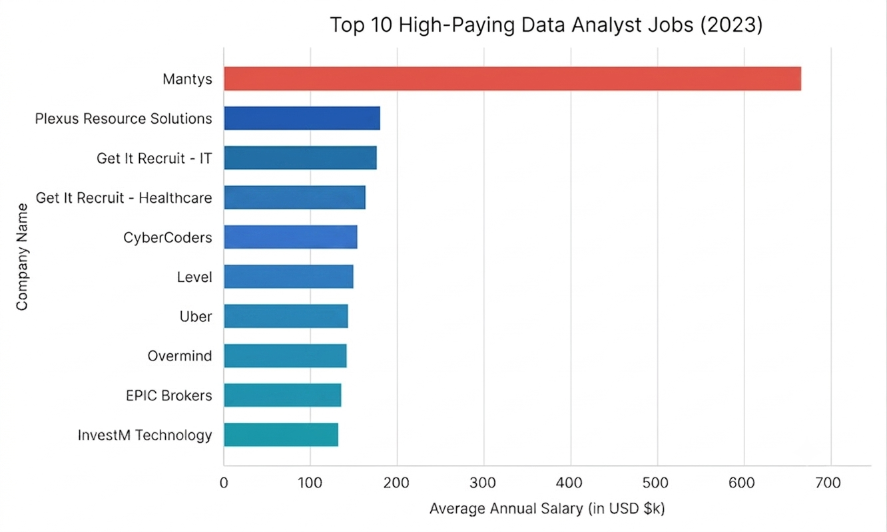
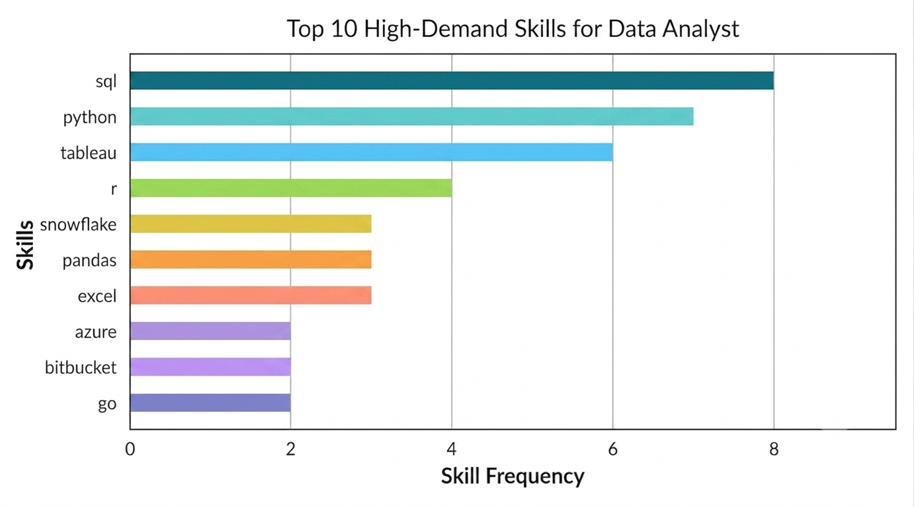

# 📌 Introduction

📊 This project is a SQL-based data analysis exercise intructed by Luke Barousse to explore, query, and generate insights from structured dataset of data job market. The goal is to practice SQL skills, including data cleaning, transformation, and analytical querying, while presenting 💰 top-paying jobs,🔥in-demand skills,📈 where high demand meets high salary in data analytics in a clear and organized manner.

🔍 SQL queries? Check them out here: [Project](Project)

# 📂 Background

This project was created to better understand the data analyst job market. The goal was to find which skills are paid the most and which are most in demand. By doing this, it makes the process of looking for good jobs easier for everyone.

### ❓The questions I would like to answer through my SQL queries:

1. What are the top-paying data analyst jobs?

2. What skills are required for these top-paying jobs?

3. What skills are most in demand for data analysts?

4. Which skills are associated with higher salaries?

5. What are the most optimal skills to learn?

# 🔧 Tools I Used

For my practice into the data analyst job market, I took advantage of the power of several key tools:

- **SQL:** The main programming of my analysis, allowing me to query the database and discover critical insights.
- **PostgreSQL:** The database management system, ideal for handling the job posting data.
- **Visual Studio Code:** My IDE for database management and executing SQL queries.
- **Git & GitHub:** Essential for version control and sharing my SQL scripts and analysis, ensuring collaboration and project tracking.

# 📊 The Analysis

Each query in this project aimed at investigating specific aspects of the data analyst job market. The following sections demonstrate how I approached each question throught the dataset of data job market.

## 1. Top Paying Data Analyst Jobs

To identify the highest-paying roles, I filtered data analyst positions by average yearly salary and location. This query highlights the high paying opportunities in the field.

```SQL
SELECT
	job_id
	, job_title
	, job_location
	, job_schedule_type
	, TO_CHAR(salary_year_avg, 'FM999,999,999') AS "Salary Average"
	, job_posted_date
	, name AS "Company Name"
FROM
	job_postings_fact
	LEFT JOIN company_dim ON job_postings_fact.company_id = company_dim.company_id
WHERE
	job_title = 'Data Analyst'
	AND salary_year_avg IS NOT NULL
	AND job_location = 'Anywhere'
ORDER BY
	salary_year_avg DESC
LIMIT 10;
```

### Insights

**📊 Insights from the Data Average Salary**

- Highest: 650,000 (Mantys).

- Lowest: 135,000 (InvestM Technology LLC and EPIC Brokers).

- Most job postings fall within the 135,000 – 165,000 range, with Mantys being the clear outlier offering a significantly higher salary.

- 👉 This shows that Mantys provides an offer far above the market average, while most other companies offer fairly consistent salaries.

**🎯 Key Takeaways**

- Mantys stands out with an unusually high salary, likely for a senior or specialized role.

- Market average: 135k – 165k is the common range for Data Analyst positions.

- Stable demand: Job postings are spread throughout the year, proving that Data Analyst is a consistently needed role.



_Bar graph visualizing the salary for the top 10 salaries for data analysts; Gemini generated this graph from my SQL query results_

## 2. Skills for Top Paying Jobs

To understand what skills are required for the top-paying jobs, I joined the job postings with the skills data, providing insights into what employers value for high-compensation roles.

```SQL
WITH top_paying_jobs AS (
    SELECT
        job_id
        , job_title
        , salary_year_avg
        , name AS company_name
    FROM
        job_postings_fact
    LEFT JOIN company_dim ON job_postings_fact.company_id = company_dim.company_id
    WHERE
        job_title_short = 'Data Analyst' AND
        job_location = 'Anywhere' AND
        salary_year_avg IS NOT NULL
    ORDER BY
        salary_year_avg DESC
    LIMIT 10
)

SELECT
    top_paying_jobs.*
    , skills
FROM top_paying_jobs
INNER JOIN skills_job_dim ON top_paying_jobs.job_id = skills_job_dim.job_id
INNER JOIN skills_dim ON skills_job_dim.skill_id = skills_dim.skill_id
ORDER BY
    salary_year_avg DESC;
```

### Insights

**📊 Skills Analysis**

- Most Frequent Skills
  - SQL: Present in nearly all job postings (AT&T, Pinterest, UCLA, SmartAsset, Inclusively, Motional, Get It Recruit).

  - Python: Also appears very frequently, especially in Principal/Director roles.

  - R: Common in Analyst-level jobs (Pinterest, Motional, Get It Recruit).

👉 SQL + Python + R form the core skill set for Data Analyst/Director positions.

**🎯 Key Takeaways**

- SQL + Python + Tableau are the foundational skills, consistently required across postings.

- Cloud & Big Data (AWS, Azure, Snowflake, Databricks, Hadoop) are linked to higher salaries, typically in Director/Principal roles.

- Visualization (Tableau, Power BI) is essential for communicating insights effectively.

- Collaboration tools (Jira, Confluence, GitLab) highlight that senior Data Analysts must work closely with technical and management teams.



## 3. In-Demand Skills for Data Analysts

This query helped identify the skills most frequently requested in job postings, directing focus to areas with highest demand.

```SQL
SELECT
    skills AS "SKill Name"
    , COUNT(skills_job_dim.job_id) AS demand_count
FROM job_postings_fact
INNER JOIN skills_job_dim ON job_postings_fact.job_id = skills_job_dim.job_id
INNER JOIN skills_dim ON skills_job_dim.skill_id = skills_dim.skill_id
WHERE
    job_title_short = 'Data Analyst'
GROUP BY
    skills
ORDER BY
    demand_count DESC
LIMIT 5;
```

### Insights

**🔍 Key Observations**

- SQL dominates: It remains the universal language of data analysis, appearing in nearly all job postings.

- Excel persists: Despite newer tools, Excel continues to be indispensable, especially for quick business reporting.

- Python rising: Its versatility in data wrangling, automation, and predictive modeling makes it a must-have skill.

- Visualization tools matter: Tableau and Power BI are increasingly required, showing the importance of data storytelling.

**🎯 Key Takeaways**

- The ideal skill set for a Data Analyst today is SQL + Python + a BI tool (Tableau/Power BI).

- Excel proficiency remains a strong differentiator, especially in non-tech industries.

- Analysts who can query (SQL), analyze (Python), and visualize (Tableau/Power BI) are best positioned for high demand roles.

| Skills   | Demand Count |
| -------- | ------------ |
| SQL      | 92,628       |
| Excel    | 67,031       |
| Python   | 57,326       |
| Tableau  | 46,554       |
| Power BI | 39,468       |

_Table of the demand for the top 5 skills in data analyst job postings_

## 4. Skills Based on Salary

Exploring the average salaries associated with different skills revealed which skills are the highest paying.

```SQL
SELECT
  skills_dim.skills AS skill
  , ROUND(AVG(job_postings_fact.salary_year_avg),2) AS avg_salary
FROM
  job_postings_fact
	INNER JOIN
	  skills_job_dim ON job_postings_fact.job_id = skills_job_dim.job_id
	INNER JOIN
	  skills_dim ON skills_job_dim.skill_id = skills_dim.skill_id
WHERE
  job_postings_fact.job_title_short = 'Data Analyst'
  AND job_postings_fact.salary_year_avg IS NOT NULL
GROUP BY
  skills_dim.skills
ORDER BY
  avg_salary DESC;
```

### Insights

**📊 Insights Analysis**

- SVN is an outlier with an exceptionally high salary, likely due to a small sample size or being a niche skill.

- Blockchain (Solidity) and NoSQL (Couchbase) are hot skills associated with high salaries.

- AI/ML frameworks (DataRobot, MXNet, dplyr) offer attractive salaries, reflecting the trend toward advanced analytics.

- Cloud & DevOps (Terraform, VMware) continue to be well-paid skill groups, underscoring their importance in data infrastructure.

- Twilio, while not a core data skill, still commands a relatively high salary thanks to demand for system integration.

**🎯 Key Takeaways**

- SVN is an outlier with an exceptionally high salary, likely due to limited data or being a niche role.

- Blockchain (Solidity) and NoSQL (Couchbase) are hot skills associated with high salaries.

- AI/ML frameworks (DataRobot, MXNet, dplyr) also offer attractive salaries, reflecting the trend toward advanced analytics.

- Cloud & DevOps (Terraform, VMware) continue to be well-paid skill groups, underscoring their importance in data infrastructure.

| Skills    | Average Salary ($) |
| --------- | -----------------: |
| svn       |            400,000 |
| solidity  |            179,000 |
| couchbase |            160,515 |
| datarobot |            155,486 |
| golang    |            155,000 |
| mxnet     |            149,000 |
| dplyr     |            147,633 |
| vmware    |            147,500 |
| terraform |            146,733 |
| twilio    |            138,500 |

_Table of the average salary for the top 10 paying skills for data analysts_

## 5. Most Optimal Skills to Learn

Combining insights from demand and salary data, this query aimed to pinpoint skills that are both in high demand and have high salaries, offering a strategic focus for skill development.

```SQL
SELECT
    skills_dim.skill_id,
    skills_dim.skills,
    COUNT(skills_job_dim.job_id) AS demand_count,
    ROUND(AVG(job_postings_fact.salary_year_avg), 0) AS avg_salary
FROM job_postings_fact
INNER JOIN skills_job_dim ON job_postings_fact.job_id = skills_job_dim.job_id
INNER JOIN skills_dim ON skills_job_dim.skill_id = skills_dim.skill_id
WHERE
    job_title_short = 'Data Analyst'
    AND salary_year_avg IS NOT NULL
GROUP BY
    skills_dim.skill_id
HAVING
    COUNT(skills_job_dim.job_id) > 10
ORDER BY
    avg_salary DESC,
    demand_count DESC
LIMIT 10;
```

| Skill ID | Skill      | Demand Count | Average Salary (USD) |
| -------- | ---------- | ------------ | -------------------- |
| 98       | Kafka      | 40           | 129,999              |
| 101      | PyTorch    | 20           | 125,226              |
| 31       | Perl       | 20           | 124,686              |
| 99       | TensorFlow | 24           | 120,647              |
| 63       | Cassandra  | 11           | 118,407              |
| 219      | Atlassian  | 15           | 117,966              |
| 96       | Airflow    | 71           | 116,387              |
| 3        | Scala      | 59           | 115,480              |
| 169      | Linux      | 58           | 114,883              |
| 234      | Confluence | 62           | 114,153              |

_Table of the most optimal skills for data analyst sorted by salary_

### Insights

**🎯 Insights from the table**

- Kafka has the highest salary (~130k USD), even though its demand count is not very large.

- PyTorch and TensorFlow: AI/ML frameworks with high salaries, reflecting strong demand for machine learning expertise.

- Airflow, Scala, Linux, Confluence: Common skills in data engineering and collaboration, with stable salaries around 114k–116k.

- Perl still appears with a relatively high salary (~124k), showing that there is ongoing niche demand.

# 📝 What I Learned

Through this project, I gained valuable lessons:

- 📊 **Practical SQL skills**: Writing efficient queries and understanding how to optimize them.

- 💡 **Data-driven thinking**: Translating analyzing questions into SQL queries.

- 🧩 **Problem-solving mindset**: Tackling challenges like missing data, complex joins, and performance issues.

- 📈 **Documentation & clarity**: Presenting results in a way that others can easily understand and replicate.

# 🚀 Conclusions

## Insights

From the analysis, several clear insights appeared:

 - **Top-Paying Data Analyst Jobs**: The highest-paying jobs for data analysts show a wide range of salaries, with the top reaching $650,000.

- **Skills for Top-Paying Jobs**: High-paying jobs often require strong skills in SQL, making it a key skill for earning a high salary.

- **Most In-Demand Skills**: SQL is also the most requested skill in the job market, so it is essential for job seekers.

- **Skills with Higher Salaries**: Special skills like SVN and Solidity are linked to the highest average salaries, showing that niche expertise is highly valued.

- **Best Skills for Market Value**: SQL is both in high demand and offers a strong average salary, making it one of the best skills for data analysts to learn.

## Closing Thoughts

This project helped me improve my SQL skills and gave me useful insights into the data analyst job market. The results act as a guide for choosing which skills to learn and focus on when looking for jobs. New data analysts can improve their chances in a competitive market by learning skills that are either in demand and well paid. This shows the importance of always learning and adapting to new trends in data analytics.